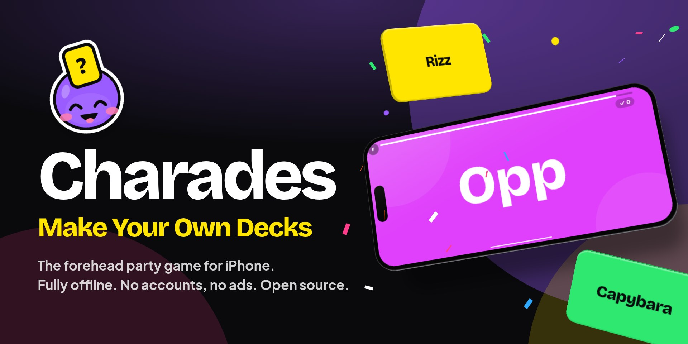
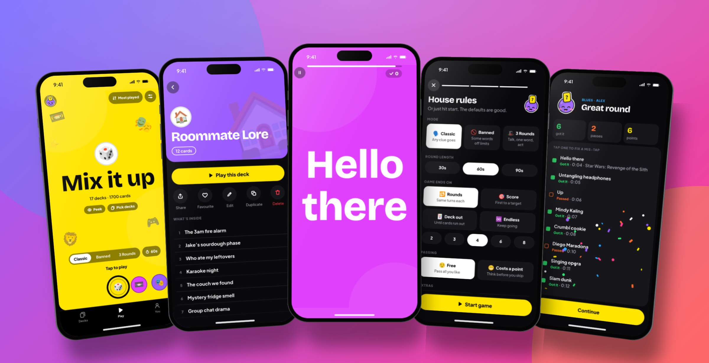
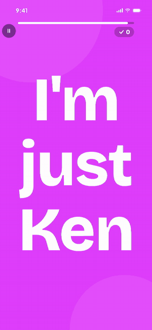
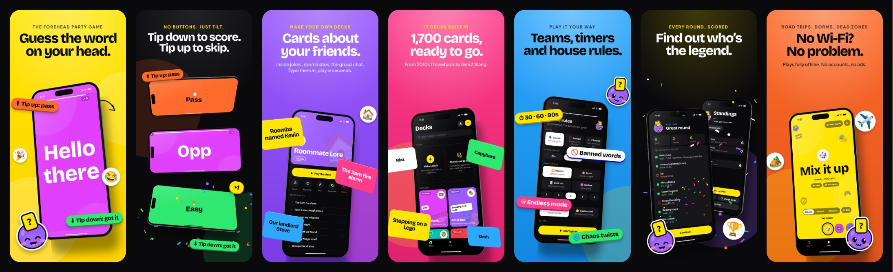
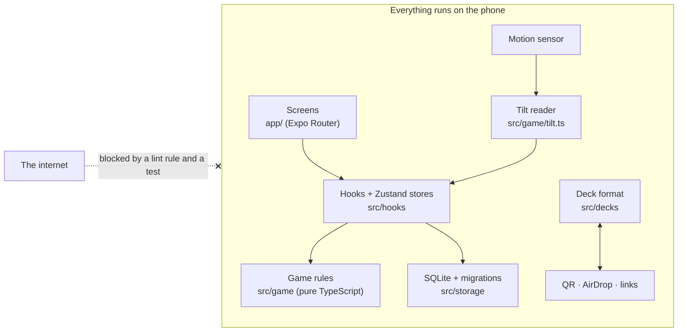
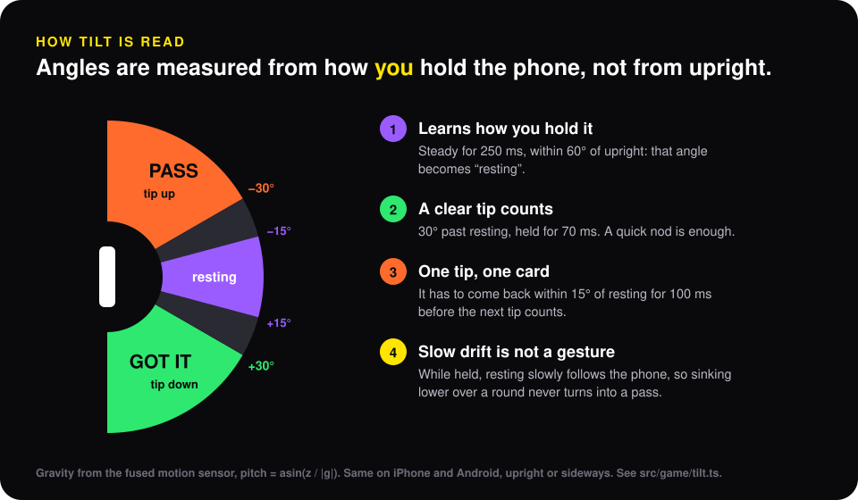

<p align="center">
  
</p>

<p align="center">
  <a href="https://bywilliaml.com/charades"><b>Website</b></a> ·
  <a href="https://bywilliaml.com/charades/privacy">Privacy</a> ·
  <a href="./SPEC.md">Spec</a> ·
  <a href="./DEPLOY.md">Ship it yourself</a> ·
  <a href="#fork-it">Fork it</a>
</p>

<p align="center">
  
  
  
  
  
  
  
</p>

# Charades: Make Your Own Decks

**The forehead party game, rebuilt to be fast, fair and fully offline.** One
player holds the phone to their forehead. Everyone else shouts clues. Tip the
phone down when you get it, up to pass. When the timer runs out, the phone goes
to the next person.

What makes it different is in the name: **you make the decks.** Inside jokes,
your roommates, the group chat, your friends' faces on photo cards. Then share a
deck with a QR code or AirDrop, with no account and no internet.

<p align="center">
  
</p>

## Why I built it

The forehead games on the App Store are fun, and they all ask for something:
a subscription to unlock decks, an account, ads between rounds, a signal in the
basement. I wanted the version I'd actually bring to a party, with these rules:

- **It never needs the internet.** No server, no account, no analytics. It works
  on a plane, in a dorm basement or at a campsite. That also means it costs
  close to nothing to run, forever.
- **Every deck is free.** All 17 built-in decks, 1,700 cards, from install.
- **Your decks are first-class.** Making a deck is as quick as typing a list.
- **The tilt has to just work.** If the phone misreads a nod, the game is
  broken, so tilt detection got the most engineering in the whole app.

## See it in action

<table>
  <tr>
    <td width="34%" align="center">
      <br>
      <sub>Real gameplay, recorded from the app.</sub>
    </td>
    <td>
      <b>A round, start to finish</b>
      <ol>
        <li>Pick a deck, or mix them all.</li>
        <li>Pass the phone. Dex counts you in: <i>“Alex, you're up.”</i></li>
        <li>Phone to the forehead, upright or sideways.</li>
        <li><b>Tip down</b>: got it, green flash, ding.<br><b>Tip up</b>: pass, orange flash, whoosh.</li>
        <li>Time's up. See every card, fix a mis-tap, and the standings update.</li>
      </ol>
      Prefer not to tilt? Switch to <b>swipe</b> or <b>tap</b> in Settings.
    </td>
  </tr>
</table>

<p align="center">
  
</p>

## Features

**🎴 Play**
- 17 decks of 100 cards: 2010s Throwback, Gen Z Slang, College Life, Act It Out, Emoji Charades, Animals, Food & Drink and more.
- Three modes: **Classic**, **Banned words** (don't say the forbidden words) and **3 Rounds** (describe, then one word, then act it out).
- Rounds of 30, 60 or 90 seconds. Play to a number of rounds, to a target score, until the deck runs out, or endlessly.
- Teams or everyone together. Free passes, or passes that cost a point.
- **Chaos twists** (a wild rule some rounds) and **forfeits** for last place.
- Pause any time. Turn the phone mid-round and nothing breaks.

**✏️ Make**
- Type cards, paste a whole list, or take **photo cards** of your friends.
- Pick a cover emoji and a colour. Add banned words per card.
- **About your group**: answer five questions and get a deck only your friends can play.
- Edit the free decks too: hide cards you don't like, add your own.

**📲 Share, offline**
- A deck travels as a **QR code**, a flipbook of QR codes for big decks, a `.charades` file over **AirDrop**, or a link.
- **Make decks with AI**: a [Claude skill](./skill/charades-deck-maker) and a [web deck maker](https://bywilliaml.com/charades/decks) write a deck in exactly the format the app imports.

**🏆 Remember**
- Standings for every game, a friends leaderboard, and a story-sized “Tonight, wrapped” image to post.

**🎨 Feel**
- Dex, the mascot: a sticker-style head with a card stuck to its forehead, and a mood for every moment.
- Sound effects, haptics, dark and light themes, and every screen laid out both upright and sideways.

## How it's built

| | |
| --- | --- |
| **App** | Expo SDK 57, React Native 0.86, React 19 with the React Compiler, Expo Router |
| **Language** | TypeScript, strict |
| **State** | Zustand stores over a local SQLite database (`expo-sqlite`), with versioned migrations |
| **Sensors** | `expo-sensors` DeviceMotion: fused gravity, 25 samples a second |
| **Sound** | `expo-audio`: seven effects, generated by a script, that respect the silent switch |
| **Tests** | Jest: 680+ tests in two projects, pure logic (`ts-jest`) and components (`jest-expo`) |
| **Builds** | EAS Build and Submit; the App Store listing lives in `store.config.json` |



### Engineering highlights

**1. Tilt that reads the person, not the phone.** Nobody holds a phone
dead upright on their forehead, and everyone leans a different amount. So the
game learns each player's resting angle and measures gestures from that. It
turns a stream of sensor readings into exactly one answer per nod, and it never
mistakes a slow sink over a minute for a pass. It's a pure state machine with no
React and no sensors inside, so it's tested against recorded motion traces:
nods, flicks, wobbles while someone gives clues, phones held sideways.

<p align="center">
  
</p>

**2. “Offline” enforced by the build.** An ESLint rule bans `fetch`,
`XMLHttpRequest`, `WebSocket` and the network-capable Expo modules. A test then
scans the source for the same things, so the rule can't be quietly switched off
with a disable comment. If anything tries to reach the internet, CI goes red.

**3. Pure game logic.** Everything in `src/game` (scoring, turns, rounds, win
conditions, team rotation, tilt) is plain TypeScript with no React Native
imports, enforced by a lint rule rather than by convention. Every rule in the
game is unit-tested without rendering a screen.

**4. A deck fits in a QR code.** A deck is JSON, then gzip, then base64url.
Small decks fit in one QR code. Big ones become a flipbook of codes that a
second phone scans in any order. The same bytes travel as a `.charades` file or
a link, so AirDrop, Messages and the camera all work with no server in between.

**5. Data that survives updates.** The database schema is versioned. Every
change ships as a migration with a test that upgrades from every older version,
so a game in progress or a deck someone spent an hour on never disappears after
an update.

**6. Store art generated from the real app.** The App Store screenshots, the
preview video and a 3D promo are all produced by
[`scripts/store-art`](./scripts/store-art). It runs the real app in Chromium,
records it frame by frame with the clock frozen, and composes the result with
CSS 3D. The soundtrack is synthesised in code. Change the app, run the script,
and the marketing is up to date.

## Run it

You need Node 22+ and an iPhone with [Expo Go](https://expo.dev/go).

```sh
npm install
npm start          # scan the QR code with your iPhone's camera
```

Checks:

```sh
npm run typecheck  # tsc --noEmit
npm run lint       # eslint, including the no-network rule
npm test           # jest
```

To install it as a real app, or ship it to the App Store:

```sh
npm run phone      # an installable build for your own iPhone
npm run store      # build and upload to TestFlight / App Store Connect
```

[DEPLOY.md](./DEPLOY.md) walks through every step, including what Apple needs.

## Fork it

I'd love for this to be a starting point. Want a forehead game for your
language, your classroom, a TV show you love, or a brand-new party game on the
same bones? Fork it.

1. **Rename it.** The code is yours to use under AGPL-3.0. The name, Dex, the
   icon and the artwork are not ([TRADEMARK.md](./TRADEMARK.md)).
2. **Set your own app ID**: `npm run setup` writes it into `app.json`.
3. **Swap the decks.** Each one is a data file in `spec/decks`. Run
   `node spec/generate-bundled-decks.js` and they're built into the app.
4. **Re-skin it.** Colours, type and spacing live in `src/ui/tokens.ts`. Dex is
   one SVG component in `src/ui/Mascot.tsx`.
5. **Change the rules.** Modes, scoring and win conditions are pure functions in
   `src/game`, with tests to tell you what you broke.

Good places to read first: [`src/game/tilt.ts`](./src/game/tilt.ts),
[`src/decks/share.ts`](./src/decks/share.ts),
[`src/storage/migrations.ts`](./src/storage/migrations.ts) and
[SPEC.md](./SPEC.md), the product spec this was built from.

## Project layout

```
app/                Screens (Expo Router)
src/
  game/             Pure game logic: no React, no React Native
  decks/            Deck schema, validation, QR and file sharing
  storage/          SQLite, repositories, migrations
  ui/               Components, design tokens, Dex the mascot
  home/             The three swipeable home pages: Decks, Play, You
  media/            Photos and sound effects
  hooks/            Stores and sensor hooks
assets/decks/       Bundled decks, generated from spec/decks
spec/               Product spec, decisions log, deck sources, generators
scripts/            App ID setup; store-art generators
skill/              The Claude skill for making decks with AI
docs/images/        The pictures in this README
```

## Docs

- [SPEC.md](./SPEC.md): the product spec, and the source of truth.
- [spec/decisions.md](./spec/decisions.md): why things are the way they are.
- [ROADMAP.md](./ROADMAP.md): build order, and what is deliberately not in v1.
- [DEPLOY.md](./DEPLOY.md): from this repo to your iPhone, or the App Store.
- [PRIVACY.md](./PRIVACY.md): what the app stores (all of it on your phone) and what it doesn't.

## Made by

**William**: [bywilliaml.com](https://bywilliaml.com) · [the Charades page](https://bywilliaml.com/charades)

If you build something from this, I'd genuinely like to see it.

## Licence

Code: [AGPL-3.0](./LICENSE). See [NOTICE](./NOTICE) for dual licensing. The
name, Dex, the icon, the screenshots and the artwork in `docs/images` are not
covered by the code licence ([TRADEMARK.md](./TRADEMARK.md)). Forks must rename.
